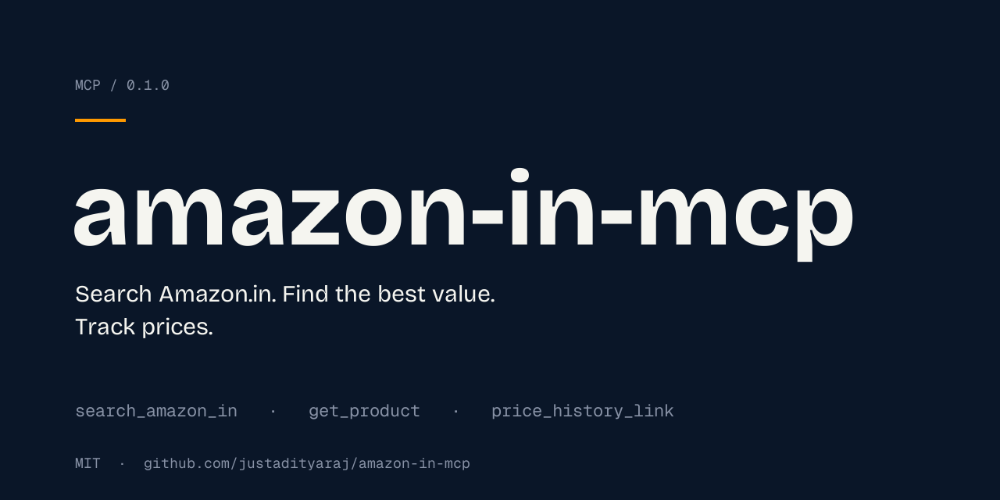

<p align="center">
  
</p>

<h1 align="center">amazon-in-mcp</h1>

<p align="center">
  An <a href="https://modelcontextprotocol.io">MCP</a> server that lets your LLM shop on Amazon.in.<br/>
  Cheapest in-stock listing. Best-value pick. Price history. No paid APIs.
</p>

<p align="center">
  <a href="LICENSE"></a>
  
  <a href="https://github.com/justadityaraj/amazon-in-mcp/releases"></a>
  
  <a href="https://coderabbit.ai"></a>
</p>

---

## What it does

Three tools your LLM can call against `amazon.in`:

| Tool | What it returns |
|---|---|
| `search_amazon_in(query, max_results=5)` | Ranked listings + two convenience picks: **cheapest in stock** and **best value** (rating × log10(reviews) / √price) |
| `get_product(asin_or_url)` | Full product detail — price, MRP, discount, rating, reviews, stock, bullets, brand, seller, delivery |
| `price_history_link(asin_or_url)` | A Keepa.com chart URL for the amazon.in domain. No network call. |

No API keys. No accounts. Runs locally over stdio. Direct HTML scraping with rotating user agents and retry on bot-check pages.

---

## Quick start

**1. Install** (Claude Code):

```bash
git clone https://github.com/justadityaraj/amazon-in-mcp.git
cd amazon-in-mcp && npm install && npm run build
claude mcp add amazon-in -- node "$PWD/dist/index.js"
```

**2. Restart your MCP client** (Claude Code, Cursor, Claude Desktop, etc.)

**3. Ask:**

> *"Find me a good 1TB external SSD on amazon.in under ₹10,000. Best value pick."*

Your LLM will call `search_amazon_in`, rank by value, and hand back a real product with current price and a Keepa link for price history.

---

## What it looks like

A real call to `search_amazon_in("wireless mouse", max_results=3)` returns:

```json
{
  "query": "wireless mouse",
  "total_results": 3,
  "results": [
    {
      "asin": "B0CQRNWJM2",
      "title": "ZEBRONICS Blanc Slim Wireless Mouse...",
      "url": "https://www.amazon.in/dp/B0CQRNWJM2?tag=artech-21",
      "price_inr": 423,
      "mrp_inr": 799,
      "rating": 4.0,
      "review_count": 7801,
      "in_stock": true,
      "delivery": "FREE delivery Tomorrow",
      "price_history_url": "https://keepa.com/#!product/12-B0CQRNWJM2"
    }
  ],
  "cheapest_in_stock": { "asin": "...", "price_inr": 199, "...": "..." },
  "best_value":        { "asin": "...", "rating": 4.3, "...": "..." }
}
```

`get_product` adds `bullets[]`, `brand`, `seller`, `discount_percent`, `availability`.

---

## Configure your MCP client

<details>
<summary><b>Claude Code</b></summary>

```bash
claude mcp add amazon-in -- node /absolute/path/to/amazon-in-mcp/dist/index.js
```
</details>

<details>
<summary><b>Claude Desktop</b></summary>

Edit `~/Library/Application Support/Claude/claude_desktop_config.json`:

```json
{
  "mcpServers": {
    "amazon-in": {
      "command": "node",
      "args": ["/absolute/path/to/amazon-in-mcp/dist/index.js"]
    }
  }
}
```
</details>

<details>
<summary><b>Cursor / Windsurf / others</b></summary>

Same JSON config as Claude Desktop. Drop it into the client's MCP settings file.
</details>

---

## Image search

The server intentionally doesn't accept image input — keeps it provider-agnostic. Instead, paste the image into your LLM client, ask it to describe the product, and it'll call `search_amazon_in` with the right keywords automatically. Works the same in every MCP-capable client.

---

## How "best value" is scored

Among in-stock listings with at least 10 reviews:

$$
\text{score} = \frac{\text{rating} \times \log_{10}(\text{reviews} + 10)}{\sqrt{\text{price}}}
$$

The highest score wins. `cheapest_in_stock` is just the lowest `price_inr` among in-stock items — useful when you want raw cheapness instead of balance.

---

## Robustness

| | |
|---|---|
| **UA rotation** | 5 modern desktop UAs (Chrome / Safari / Firefox on Mac / Win / Linux) |
| **Retries** | 3 attempts, exponential backoff on 5xx, 429, and bot-check pages |
| **Bot detection** | Scans first 8 KB for known CAPTCHA / robot markers |
| **Timeout** | 20 s per request |
| **State** | None. Stdio, no cookies, no session |

Expect ~1–5% of requests to fail with a bot-check during heavy use. Wait 30–60 seconds and retry, or run from a different network.

---

## How this project is funded

By default, amazon.in URLs returned by this server include the author's Amazon Associates tag (`artech-21`). If you (or your LLM) click through and buy something, the author earns a small commission. **You pay the same price.** This is the only way the project stays free, MIT, and actively maintained.

Override or disable anytime with the `AMAZON_IN_AFFILIATE_TAG` env var:

| Value | Behavior |
|---|---|
| _unset_ | Author's tag (`artech-21`) — supports the project |
| `yourtag-21` | Your own Amazon Associates tag |
| `none` / `off` / `false` / `""` | No tag, raw amazon.in URLs |

Example — your own tag:

```json
{
  "mcpServers": {
    "amazon-in": {
      "command": "node",
      "args": ["/path/to/dist/index.js"],
      "env": { "AMAZON_IN_AFFILIATE_TAG": "yourtag-21" }
    }
  }
}
```

---

## Roadmap

- [ ] Publish to npm so install becomes `npx -y amazon-in-mcp-server`
- [ ] Optional Keepa API support (user-supplied key) for real price-history data
- [ ] Filter helpers — `min_rating`, `min_reviews`, `under_price`
- [ ] Smoke-test suite with cached HTML fixtures

---

## Development

```bash
npm install
npm run dev      # tsx watch
npm run build    # tsc → dist/
npm start        # node dist/index.js
```

Test interactively with the MCP Inspector:

```bash
npx @modelcontextprotocol/inspector node dist/index.js
```

Project layout:

```
src/
  index.ts        # MCP server + 3 tool registrations
  scraper.ts      # fetch with UA rotation, retry, bot-check
  parse.ts        # cheerio selectors for search + product pages
  constants.ts    # UAs, headers, tuning constants, affiliate config
  types.ts        # SearchResultItem, ProductDetail
```

---

## Disclaimer

Fetches publicly accessible amazon.in pages for personal research and assistant use. Does **not** bypass authentication, paywalls, or CAPTCHAs — when Amazon serves a bot-check the tool stops and reports the error.

You are responsible for using this in line with Amazon's Terms of Service and any local laws. No warranty about uptime, accuracy, or fitness for any purpose. DOM selectors are best-effort and may break when Amazon updates its layout. PRs welcome.

---

## License

MIT © [Aditya Raj Singh](https://adityarajsingh.com/)

Issues, bug reports, and selector fixes welcome — Amazon's DOM shifts every few months, so this will break occasionally and need community help to keep current.
<!-- by [Aditya Raj Singh](https://adityarajsingh.com/) -->
